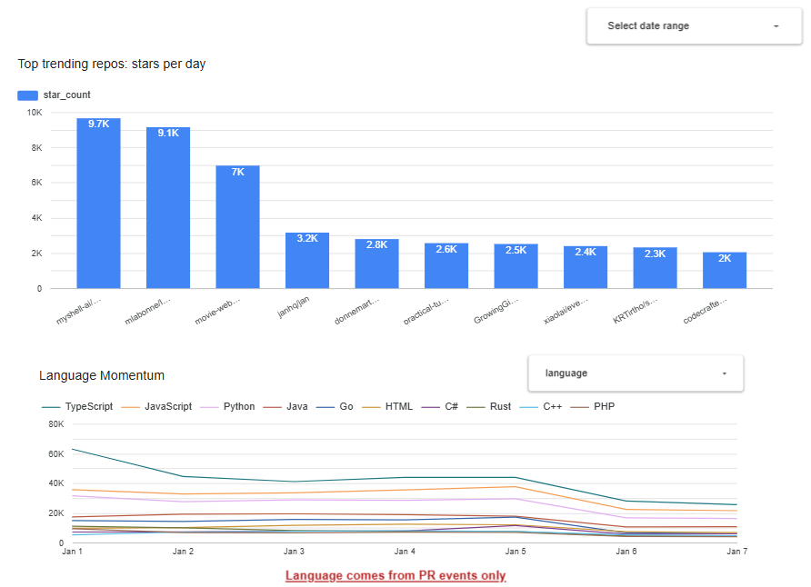
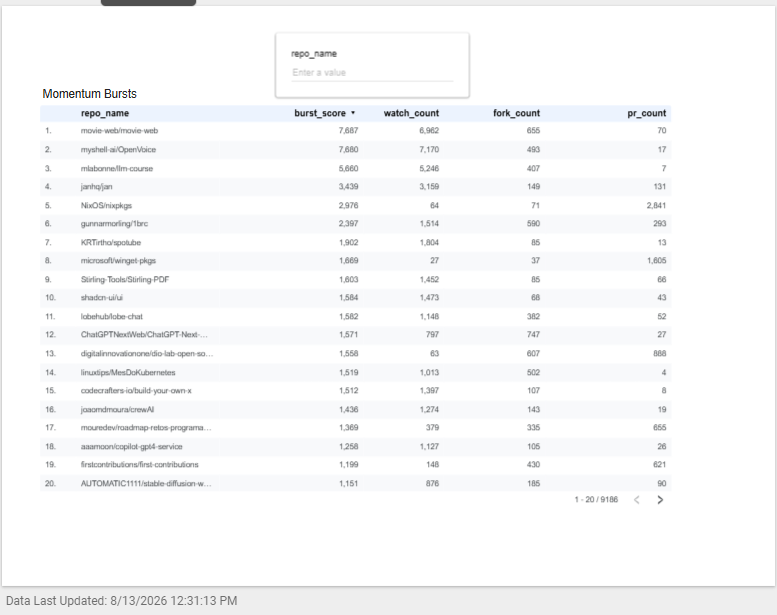

# GitHub Pulse

A batch data pipeline that turns raw [GH Archive](https://www.gharchive.org/) public-event data
into a **"which languages and projects are gaining momentum"** dashboard — built end-to-end on
GCP and kept entirely inside the always-free tier.

> DataTalksClub Data Engineering Zoomcamp capstone. Also a resume project: the interesting part
> isn't "I moved JSON to BigQuery", it's the **cost-engineering** (staying under 10 GB storage /
> 1 TB queries a month) and the **reproducibility** (one clone + documented steps → working
> pipeline).

## Problem

GH Archive publishes every public GitHub event as hourly `.json.gz` files. Raw, a single day is
~6–10 GB of JSON and a useful window (7 days) is ~50 GB — which alone blows past BigQuery's 10 GB
free storage. GitHub Pulse answers "what's trending on GitHub this week?" without ever leaving
the free tier, by projecting only the needed fields into columnar Parquet **before** loading.

## Architecture

```
GH Archive .json.gz ──► transform (slim Parquet) ──► GCS lake ──► BigQuery (partitioned/clustered)
                                                                        │
                                                                        ▼
                                                          dbt (staging → marts) ──► Looker Studio
```

- **Ingestion** (`ingestion/`): Python, parametrized by date. Downloads 24 hourly files,
  stream-parses them, keeps only needed fields, writes Parquet, uploads to GCS, loads to a
  partitioned + clustered BigQuery table. A separate enrichment step
  (`ingestion/enrich_language.py`) fetches repo language from the GitHub REST API and caches it in
  BigQuery, since GitHub stopped sending it on PR event payloads (see "Design notes" below).
- **Warehouse** (`dbt/`): staging (cast/dedupe) → marts (`fct_events`, `dim_repo`,
  `agg_repo_trending_daily`, `agg_language_daily`, `agg_repo_momentum`, `agg_event_type_daily`).
- **Orchestration** (`orchestration/`): a Kestra flow chains the four stages + `dbt build`, and is
  the on-demand/backfill path (`kestra flow execute`, or `make backfill` for ingestion-only). The
  **live daily run is `.github/workflows/daily_ingest.yml`** — a scheduled GitHub Actions
  workflow — since Kestra only runs while its Docker container is up on a laptop, and this pipeline
  needed to run unattended every day. Kestra's own daily trigger is present but `disabled: true`
  for that reason; re-enabling it is safe by default (`recoverMissedSchedules: NONE`), so it stays
  demoable without risking a pile of catch-up executions.
- **Infra** (`terraform/`): GCS bucket (30-day lifecycle) + `raw` BQ dataset (30-day partition
  expiration — bounds storage under the free tier for a rolling live pipeline) + `marts` dataset +
  least-privilege service account.
- **CI** (`.github/workflows/ci.yml`): creds-free — lint (ruff, sqlfluff) + pytest + `dbt parse`.

```
GH Archive .json.gz (24 files/day)
        │  download.py
        ▼
Python extract/transform  ──►  slim columnar Parquet   (transform.py: project only needed fields)
        │  upload_gcs.py
        ▼
GCS data lake (raw .gz + parquet)
        │  load_bq.py
        ▼
BigQuery raw table   (partitioned by event date, clustered by event type)
        │  enrich_language.py (GitHub REST API -> raw.repo_language cache)
        │  dbt
        ▼
dbt staging → marts  (fct_events, dim_repo, agg_repo_trending_daily, agg_language_daily, agg_repo_momentum)
        │
        ▼
Looker Studio dashboard (3 tiles + date / repo / language filters)
```
<!-- images/dashboard.png: TODO once the Looker Studio dashboard is built (roadmap step 6) -->

## Dashboard

Three tiles in Looker Studio (now branded Data Studio), with date / repo / language filters:
1. **Trending repos** — top repos by star (WatchEvent) count this week (`agg_repo_trending_daily`).
2. **Language momentum** — daily PR-event counts per language over time (`agg_language_daily`).
3. **Momentum bursts** — repos ranked by cross-signal burst score (watch + fork + PR on the same day, `agg_repo_momentum`).





The date-range control spans all three tiles (each chart sets `event_date` as its date-range
dimension). The language and repo controls are scoped to their own tile — a Looker Studio filter
control only reaches charts sharing its data source, and blending three marts to unify them would
be cosmetic work for no analytical gain.

Worth reading the momentum table against the trending chart: rows 1–3 are star-driven discovery,
`NixOS/nixpkgs` is almost pure PR volume, and `gunnarmorling/1brc` spikes all three signals at
once. That contrast is why the two repo tiles are separate models rather than one.

## How I kept it free

- **Project columns at ingest** and store **Parquet, not raw JSON** — 7 days stays < ~1 GB.
- **Partition** raw + `fct_events` by `event_date`, **cluster** by `event_type`; mark them
  `require_partition_filter` so unfiltered scans error instead of scanning everything.
- **30-day partition expiration** on the raw dataset (`terraform/main.tf`) — bounds storage to a
  rolling window instead of growing forever. Measured against the live data: `events` +
  `fct_events` grow at ~0.57 GB/day combined, so 30 days settles around **~17 GB at steady state —
  over the 10 GB free tier** (~$0.15/month overage). A 14-day window would fit inside the free
  tier with margin; 30 was kept anyway for a more useful rolling dashboard, trading a few cents a
  month for it deliberately rather than by accident.
- **`maximum_bytes_billed`** set in the dbt profile — a runaway query fails instead of billing.
- A **GCP billing budget alert** at a low threshold as a backstop.

## Run it (fresh clone)

Prereqs: Python 3.11+, a GCP project with billing enabled, `gcloud`, Terraform, Docker.

```bash
# 1. auth + deps (activate a venv first: python -m venv .venv && source .venv/bin/activate)
gcloud auth application-default login
cp .env.example .env   # fill in GCP_PROJECT_ID + GCS_BUCKET
make setup

# 2. infra
make tf-apply

# 3. ingest a 7-day window (use recent dates — the raw table's 30-day partition
#    expiration silently drops anything that ages out)
make backfill START=2026-08-06 DAYS=7

# 4. transform
make dbt

# 5. keep it running daily without a laptop: GitHub Actions
# Settings > Secrets and variables > Actions > New repository secret, name GCP_SA_KEY,
# paste the contents of the service-account key (terraform output, or reuse Kestra's below).
# Also add GH_PAT (a scopeless classic GitHub PAT — public repos only, 5,000 req/hr) for the
# language-enrichment step.
# .github/workflows/daily_ingest.yml then runs on its own at 06:00 UTC.

# 6. (optional) Kestra for on-demand runs / demoing the orchestration pattern
make up
# open http://localhost:8080, load orchestration/flows/github_pulse.yml (Flows > Import — the
# postgres-backed setup here doesn't auto-load ./flows), then trigger it manually. Its own daily
# schedule ships disabled — GitHub Actions is what runs the pipeline unattended.
```

Then point Looker Studio at the `github_pulse_marts` dataset and rebuild the three tiles.

## Design notes

- **Why Kestra, not Airflow?** A single `docker-compose` (Kestra + Postgres, ~1–2 GB RAM) runs
  the daily-batch demo locally — no always-on VM. Airflow (~4 GB) won't fit a free `e2-micro`.
  Orchestration concepts transfer; I picked the tool that fit the constraint.
- **Why does language come from the GitHub REST API instead of the event payload?** GH Archive
  used to carry it at `PullRequestEvent.payload.pull_request.base.repo.language`, but GitHub
  stopped sending that field on live data — the field is still projected by `transform.py` for
  schema stability, but it's always NULL now. `ingestion/enrich_language.py` fetches
  `GET /repos/{owner}/{repo}` for repos seen in recent PR events and caches the result
  (unpartitioned, TTL-based refresh, budget-capped per run);
  `dim_repo` and `agg_language_daily` join to that cache instead. `GH_PAT` (a scopeless classic
  PAT is enough for public repos) needs to be set as a repo secret for this step to run.

## What's next

- Streaming variant via **Pub/Sub** for near-real-time ingestion.
- **dlt** for declarative, schema-evolving extract/load.
- A small **FastAPI/CLI "trends API"** over the `agg_*` tables, so the project reads as software
  (typed endpoints, tests, OpenAPI) — not just a pipeline.
